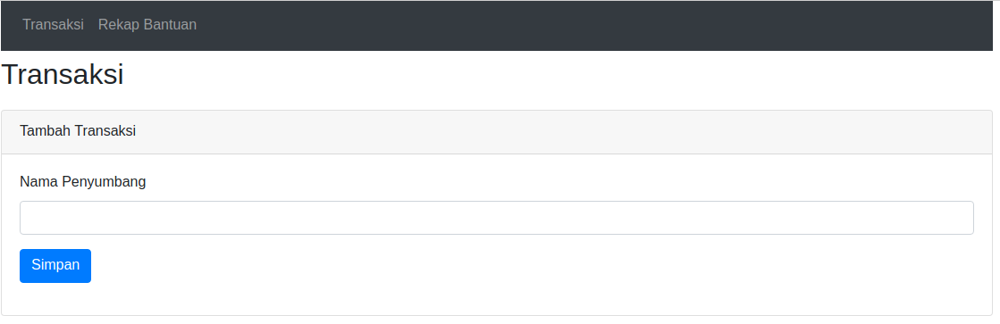
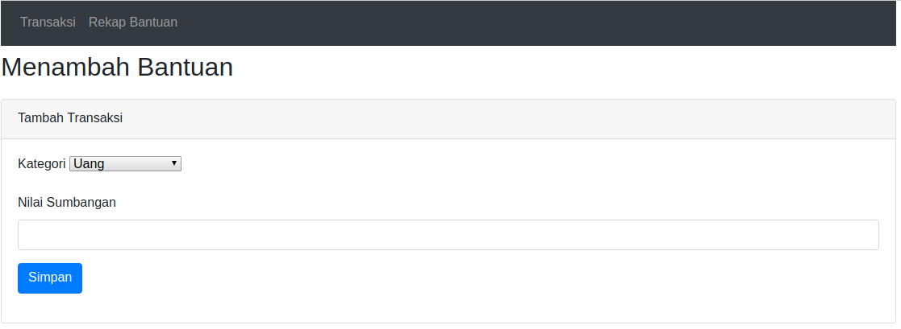
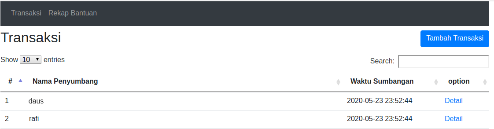
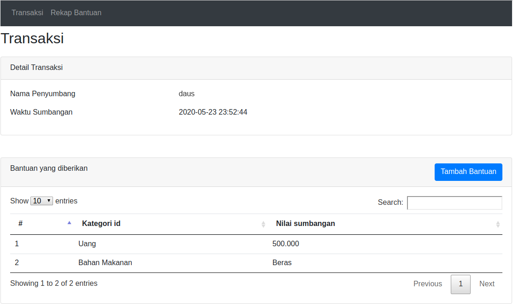
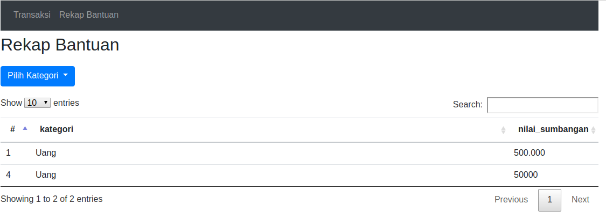
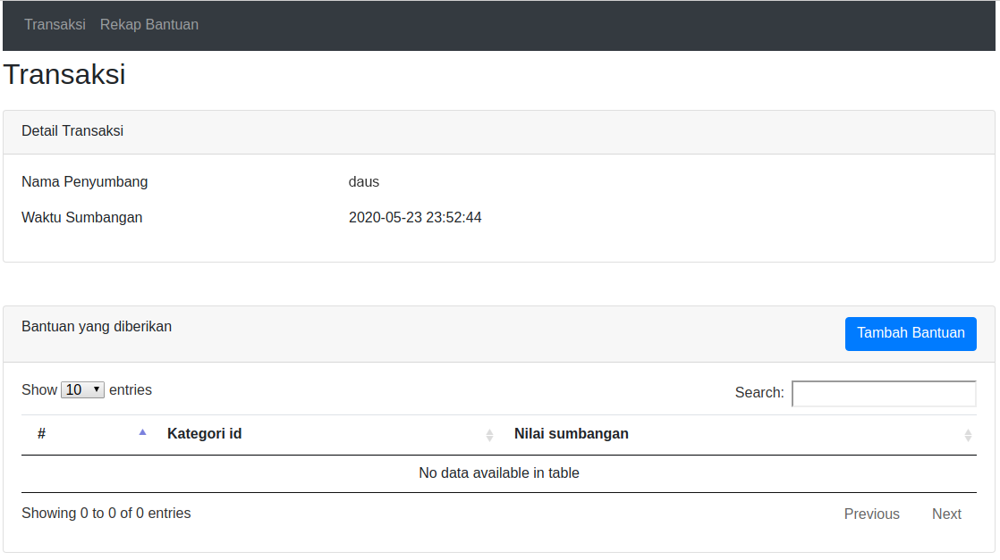
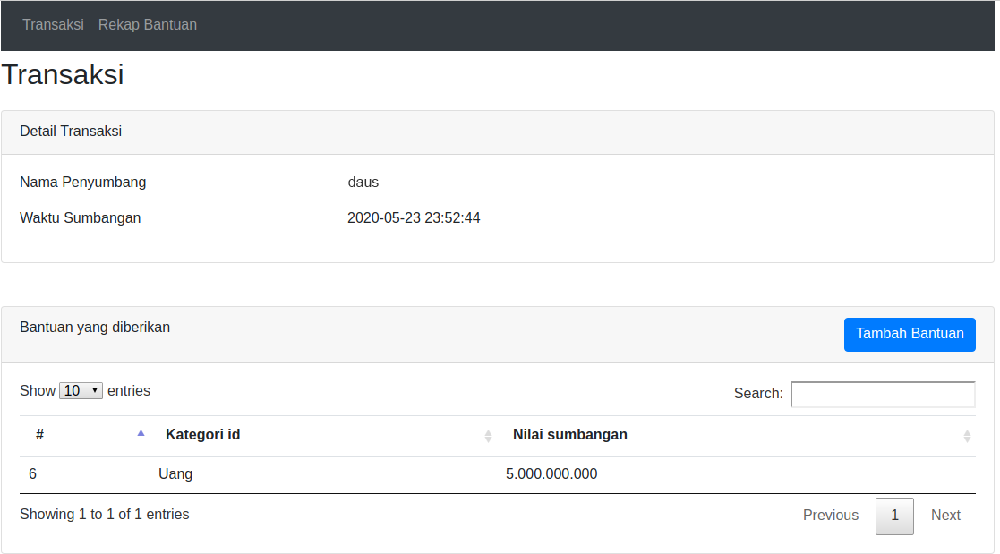

# FP-PBKK-05111740000147

Nama 	: Ahmad Firdaus
NRP 	: 05111740000188
Kelas	: PBKK - E

Deskripsi Aplikasi 
Aplikasi ini bertujuan untuk melakukan pendataan bantuan selama masa Pandemi Covid-19.

Pada aplikasi ini memiliki beberapa fitur yaitu:

# A. Menambah Transaksi
Pada fitur ini kita dapat mencatat nama penyumbang dan waktu sumbangan di lakukan.

# B. Menambah Bantuan
Pada fitur ini kita menambahkan informasi berupa bantuan apa yang disumbangkan dari transaksi tersebut.

# C. Melihat Daftar Transaksi
Pada fitur ini kita bisa melihat Transaksi apa saja yang sudah di lakukan

# D. Melihat Detail Transaksi
Pada fitur ini kita bisa melihat siapa nama penyumbang, waktu sumbangan di lakukan, dan daftar bantuan yang telah di berikan.

# E. Melihat Rekap Bantuan
Pada fitur ini kita bisa melihat rekap bantuan berdasarkan kategori bantuannya.

## Contoh Input Bantuan
Setelah daus menambah daftar transaksi, daus menambahkan jenis dan nilai bantuan yang akan diberikan, maka bantuan tersebut akan terlihat pada gambar ke 3.

